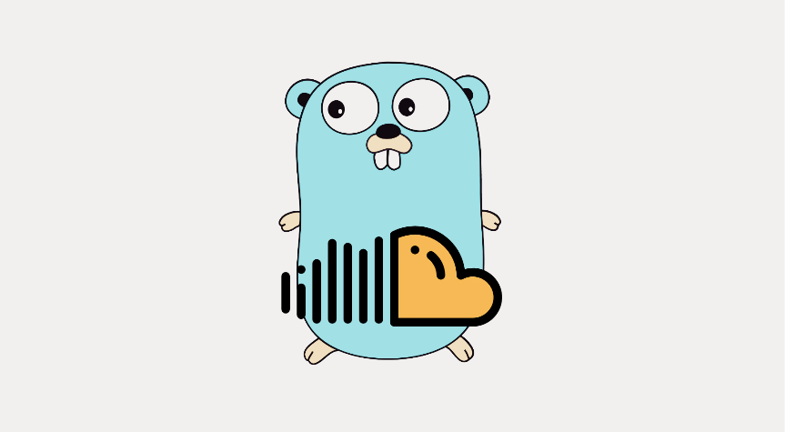
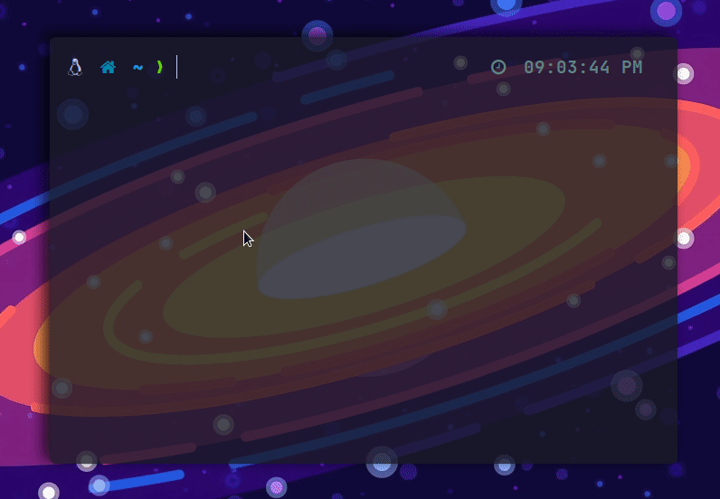
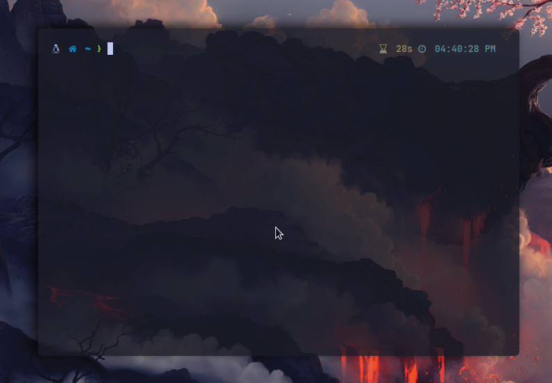
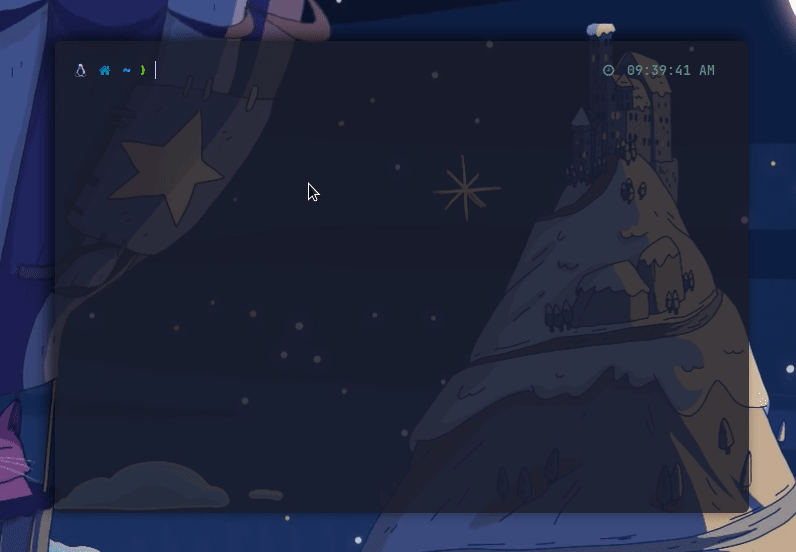

<p align="center">
    
</p>

<h1 align="center">
SoundCloud-dl


</h1>

A simple CLI app written in GO used to download sound-tracks from soundcloud with a nice UI and some cool features like downloading with multiple formats/qualities and search.

# Overview

`soundcloud-dl` is a compiled CLI app that uses the soundcloud API to :

- Download tracks by URL.
- Search in-app and download.
- Save tracks with tags/metadata : `Artwork Image`, `Creation Date`, `Author Name`.
- Multiple formats and qualities.
- [Blazingly Fast](https://youtu.be/Z0GX2mTUtfo)
- Download playlists.
- Download user's tracks and playlists. (coming soon).

# Installation

There are multiple ways to install, the easiest is :
```
go install github.com/AYehia0/soundcloud-dl@latest
```
other way is to grab is the source code and build.

# How to use ?

Make sure to read the help menu.

```
Usage:
  sc <url> [flags]

Flags:
  -b, --best                   Download with the best available quality.
  -p, --download-path string   The download path where tracks are stored. (default "/home/none/Things/github/soundcloud-dl")
  -h, --help                   help for sc
  -s, --search-and-download    Search for tracks by title and prompt one for download 
  -v, --version                version for sc
```

Notes : `-s` can't work with a `url` passed.

- **Download through a given URL**
<p align="center">
    
</p>

- **Download through search**

Note: search is limited to 6 results of type `track`, later on maybe `playlist` will be added. Also pagination may be add!.

<p align="center">
    
</p>

- **Download a playlist**

Note : when downloading a playlist, it uses the flag `--best` to grab the best quality.

<p align="center">
    
</p>
